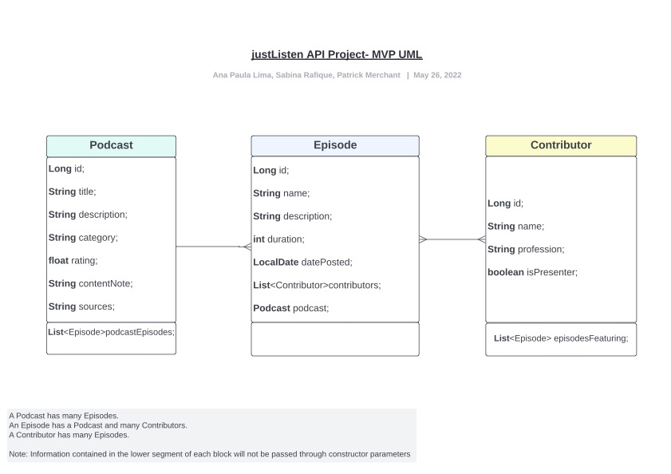
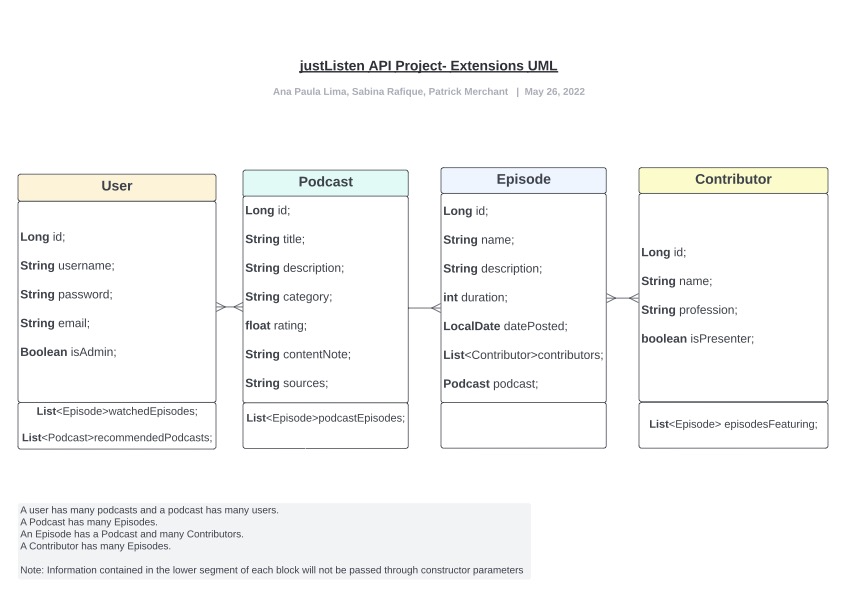
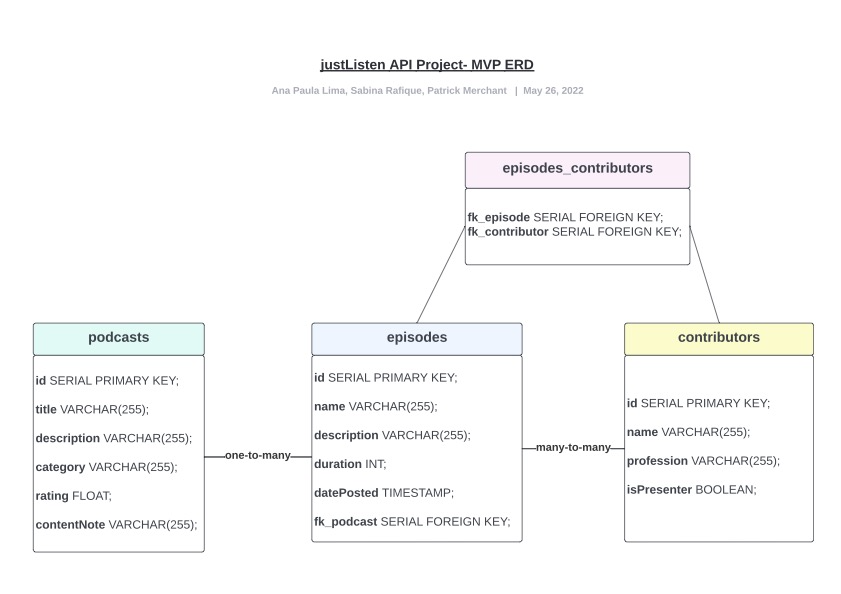
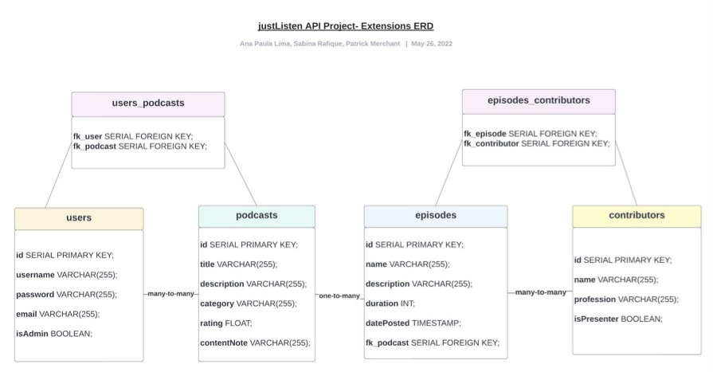

# READ ME (JustListen API):

Everyone has a podcast these days! With our JustListen API, you can quickly search through audible content based on your favourite guests, presenters and categories - and even find where to listen online!

 

## Who we are:
We are the team behind JustListen - 3 members of Cohort 5 from the Bright Network Technology Academy!

- Ana Paula Lima 
    - Github: [https://github.com/AnaPaulaL27], 
    - LinkedIn: [https://www.linkedin.com/in/ana-paula-l-5159a01b3/]

- Patrick Merchant 
    - Github: [https://github.com/patrick-merchant], 
    - LinkedIn: [https://www.linkedin.com/in/patrick-merchant-71001520b/]

- Sabina Rafique 
    - Github: [https://github.com/SabinaRafique],
    - LinkedIn: [https://www.linkedin.com/in/sabina-r-2021321ba/]

 

## Project Overview:
As part of the Bright Network Technology Academy, we were assigned a group project to research, plan and develop an API within a week. As a group, we wanted to create an API which solved a problem.
 

Currently, there are loads of podcasts spread across a multitude of platforms which makes it difficult for users to keep track of them! This is where JustListen comes in - a handy API where you can search for podcasts by your favourite presenters, guests and categories! You can also get a random podcast recommendation and users can receive 3 random recommendations for podcasts they have not listened to before!

 

 ### This API features:
 
    - One-to-Many and Many-to-Many relationships
    - Derived queries and customer queries for multiple endpoints
    - Full CRUD functionality

 

## Table of Contents:

1. Setup and Instructions

## Setup and Instructions for using the Project:

1. Make sure that you have Java 18 installed to run JustListen API
2. Clone this repository by typing the following command into your terminal:  
git clone git@github.com:patrick-merchant/backend-project.git
3. You can access the endpoints via an API platform such as Postman or through the browser at https://localhost:8080/{endpoint}
4. You can also view the SQL tables by connecting to the h2 datatbase at https://localhost:8080/h2 and entering the following URL in the 'JDBC URL' section - jdbc:h2:file:./db/just_listen_api

## Project Structure:
### Unified Modelling Language Diagrams (UML):

 
MVP:

 

Extension:

### Entity Relationship Diagrams (ERD):
 
MVP:

 
Extension:

## Minimum Viable Product (MVP):
For our MVP, we wanted to create an API with full CRUD functionality.with 3x classes:
- Podcasts
- Episodes
- Contributors

## Extensions:
// Sabina
// 'Shuffle' button (insert screenshot of code?)

// Expand it further - user gets 3 random recommendations (insert screenshots of code?)

## Plain Old Java Objects (POJOs):
//Ana Paula

This section highlights the POJOS used within the project:

| Plain Old Java Object (POJO) | Type| Input Structure|
| ----------- | ----------- |---------|
| Contributor |             |              |
| Episode| Text |               |           |
| Podcast| Text |           |               |
| User| Text |                |             |

## Running the API - List of Possible Commands (CRUD Functionality:)
A couple of notes:
- Each class has full CRUD functionality, and a number of filters.
- Any filters that could take in Strings do - this allowed us to use derived queries with "ContainingIgnoreCase" to reduce user input error and offer multiple options in e.g. Podcast sources.

localhost:8080/ ...

| HTTP Request Path                                                        | Request Type | Description                                      |
|:-------------------------------------------------------------------------|:-------------|:-------------------------------------------------|
| `.../contributors`  | `GET` | Get All Contributor Entries |
| `.../contributors/{id} ` | `GET` | Get Contributor by Id |
| `.../contributors?name={name} `| `GET`| Get Contributors by name |
| `.../contributors?profession={profession} ` | `GET` | Get Contributors by profession |
| `.../contributors?isPresenter={true/false} ` | `GET` | Get Contributors by whether they are a presenter (or a guest |
| `.../contributors ` | `POST` | Post/Create Contributor |
| `.../contributors/{id} ` | `PUT` | Update Contributor by id |
| `.../contributors/{id}` | `DELETE` | Delete Contributor by id |
| `.../episodes` | `GET` | Get All Episode Entries |
| `.../episodes/{id}` | `GET` | Get Episode By id |
| `.../episodes?name={name}` | `GET` | Get Episodes by name |
| `.../episodes?description={description}` | `GET` | Get Episodes by description contains ... |
| `.../episodes?durationLessThan={duration}` | `GET` | Get Episodes by duration less than ... |
| `.../episodes?contributorName={contributorName}`| `GET` | Get Episodes by Contributor name |
| `.../episodes ` | `POST` | Post/Create Episode |
| `.../episodes/{id} ` | `PUT` | Update Episode by id |
| `.../episodes/{id}` | `DELETE` | Delete Episode by id |
| `.../podcasts` | `GET` | Get All Podcast Entries |
| `.../podcasts/{id}` | `GET` | Get Podcast by id |
| `.../podcasts?title={title}` | `GET` | Get Podcasts by title |
| `.../podcasts?description={description}` | `GET` | Get Podcasts by description contains ... |
| `.../podcasts?category={category}` | `GET` | Get Podcasts by category ... |
| `.../podcasts?rating={rating}` | `GET` | Get Podcasts by rating great than ... |
| `.../podcasts?sources={sources}`| `GET` | Get Podcasts by sources contains ... |
| `.../podcasts ` | `POST` | Post/Create Podcast |
| `.../podcasts/{id} ` | `PUT` | Update Podcast by id |
| `.../podcasts/{id}` | `DELETE` | Delete Podcast by id |
| `.../users` | `GET` | Get All User Entries |
| `.../users/{id}` | `GET` | Get User by id |
| `.../users/{id} ` | `PUT` | Update User by id |
| `.../users/{id}` | `DELETE` | Delete User by id |
| `.../users/getrec/{userid}` | `GET` | Give User a podcast recommendation set of 3 |
| `.../users/deleterec/{userid}/{podcastid}` | `DELETE` | Delete a user's podcast recommendation |
| `.../users/replacerec/{userid}/{podcastid}` | `POST` | Replace a user's podcast recommendation |
| `.../users/addwatched/{userid}/{episodeid}` | `POST` | Add a watched episode to user's watched list |
| `.../users/deletewatched/{userid}/{episodeid}` | `DELETE` | Delete a watched episode from user's watched list |

## Testing:
//Ana Paula

## Thank you for reading this guide!
//Ana Paula

## Acknowledgments:
//Ana Paula